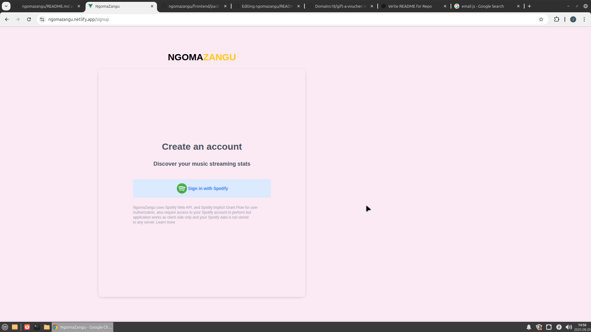

# NgomaZangu – Spotify Music Analytics Dashboard  

[](https://ngomazangu.netlify.app)  
[](https://github.com/codewithAntony/ngomazangu)  

NgomaZangu is a Spotify-powered analytics dashboard that lets users visualize their listening habits in a clean, modern interface. It integrates with the Spotify API to display top tracks, artists, playlists, and personalized stats.  

Built with **Vue 3**, **TailwindCSS**, and **Spotify OAuth authentication**, this project showcases real-world skills in API integration, authentication flows, and data visualization.
---

## Features  

- **Spotify Authentication** – Secure login with Spotify OAuth.  
- **Music Analytics Dashboard** – See top tracks, artists, and genres.  
- **Clean UI with TailwindCSS** – Responsive, mobile-friendly design
- **Real-Time API Integration** – Fetch live user data from Spotify.  
- **Listening History** – Explore recently played tracks.  
- **Deployed Live on Netlify** – Fast and production-ready.  

---

## Tech Stack  

## Frontend
- Vue 3 with TypeScript
- TailwindCSS for styling
- Axios for API requests
- Email.js for sending emails
- Vitest for unit testing
- Lucide Vue for lightweight Icons
## Backend
- Node.js with TypeScript
- Express.js for API endpoints
- Vitest for unit testing
## API
- Spotify Web API
## Auth
- Spotify OAuth
 

---


### Homepage


### Signup




### Dashboard

 


---

## Getting Started  

### 1. Clone the Repository  
```bash

git clone https://github.com/codewithAntony/ngomazangu.git

cd ngomazangu

```
---

### 2. Install Dependencies 
```bash

npm install

```
---
### 3. Create a Spotify App
1. Go to the [Spotify Developer Dashboard](https://developer.spotify.com/dashboard/applications).
2. Create a new app and copy your Client ID & Client Secret.
3. Add your callback/redirect URI (e.g., `http://localhost:3000/callback`)

---
### 4. Set Up Environment Variables
- Create a .env file in the root directory and add:
```bash

VITE_SPOTIFY_CLIENT_ID=your_client_id

VITE_SPOTIFY_CLIENT_SECRET=your_client_secret

VITE_REDIRECT_URI=http://localhost:3000/callback

```
---

### 5. Run the app
```bash

npm run dev

```

---

### Deployment
This project is deployed on Netlify:
[](https://ngomazangu.netlify.app) 

---

To deploy tour own version
```bash
npm run build
```
Then upload the ```/dist ``` folder to netlify


